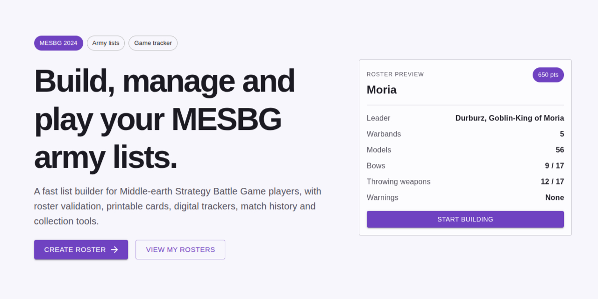

# MESBG List Builder

MESBG List Builder is an unofficial companion application for the **Middle-earth Strategy Battle Game**.



The project is being developed as a broader toolkit for MESBG players, with functionality for army building, game
reference, collections, games, Battle Companies, tournaments, and player discovery.

The current development focus is the frontend application and the game-data pipeline.

<!-- TOC -->
* [MESBG List Builder](#mesbg-list-builder)
  * [Project structure](#project-structure)
  * [Technology](#technology)
  * [Local development](#local-development)
    * [Requirements](#requirements)
    * [Clone the repository](#clone-the-repository)
    * [Initial setup](#initial-setup)
      * [Linux and macOS](#linux-and-macos)
      * [Windows](#windows)
  * [Running the application](#running-the-application)
  * [Working with game data](#working-with-game-data)
    * [One-off generation](#one-off-generation)
    * [Working on data locally](#working-on-data-locally)
    * [Checking data changes](#checking-data-changes)
  * [Repository commands](#repository-commands)
  * [Architecture](#architecture)
    * [Game data](#game-data)
    * [User data](#user-data)
  * [Commit messages](#commit-messages)
    * [Commit types and changelog](#commit-types-and-changelog)
    * [Breaking changes](#breaking-changes)
  * [Changelog and releases](#changelog-and-releases)
  * [Contributing](#contributing)
  * [Disclaimer](#disclaimer)
<!-- TOC -->

## Project structure

```text
.
├── apps/
│   ├── frontend/              # React frontend
│   └── backend/               # Spring Boot backend
│
├── data/
│   ├── raw/                   # Source Excel workbooks
│   ├── scripts/               # Data generation pipeline
│   └── generated/             # Generated JSON consumed by the frontend
│
├── api/
│   ├── openapi.yaml           # API contract
│   └── schemas/               # API schemas
│
├── scripts/
│   ├── quick-start.sh         # Linux/macOS development bootstrap
│   ├── quick-start.bat        # Windows development bootstrap
│   ├── version.sh             # Version management
│   └── release.sh             # Release automation
│
├── Makefile                   # Repository commands
├── pnpm-workspace.yaml        # pnpm workspace configuration
└── cliff.toml                 # Changelog configuration
```

## Technology

The frontend is built with React, TypeScript, Vite, Material UI, Redux Toolkit, and i18next.

The backend is built with Java 25 and Spring Boot.

Game data is maintained in Excel workbooks and transformed into JSON during development and builds. The generated data
is consumed directly by the frontend and does not require the backend.

## Local development

### Requirements

The repository provides bootstrap scripts that install or configure most development dependencies automatically.

The configured versions are:

- Java 25
- Node 24
- pnpm 11
- GNU Make

Git is also required.

### Clone the repository

```bash
git clone git@github.com:mhollink/mesbg-list-builder.git
cd mesbg-list-builder
```

### Initial setup

#### Linux and macOS

Run:

```bash
./scripts/quick-start.sh
```

The script:

- installs or verifies Java
- installs and configures fnm
- installs the configured Node.js version
- enables the configured pnpm version through Corepack
- installs GNU Make when necessary
- installs the pnpm workspace dependencies
- downloads the backend Maven dependencies

#### Windows

Run the bootstrap script from Command Prompt or PowerShell:

```bat
scripts\quick-start.bat
```

The Windows bootstrap additionally configures Git Bash so that fnm and the repository's Make-based commands can be used
there.

After the initial setup, use **Git Bash** for the normal development workflow:

```bash
make
```

Running `make` without a target displays the available repository commands.

## Running the application

The frontend development server can be started from the repository root:

```bash
make frontend
```

Vite will print the local development URL when it starts.

The Spring Boot backend can be started separately with:

```bash
make backend
```

The frontend and backend are intentionally separate processes, so each can be restarted or debugged independently.

## Working with game data

Game data is maintained in Excel workbooks under:

```text
data/raw/
```

The directory currently contains source files for profiles, options, rules, translations, and army lists.

Generated application data is written to:

```text
data/generated/
```

Do not manually edit generated JSON. Changes should be made to the source workbooks and regenerated.

### One-off generation

To generate the data once:

```bash
make data
```

### Working on data locally

For regular data work, run the data watcher and frontend in separate terminals.

Terminal 1:

```bash
make watch-data
```

Terminal 2:

```bash
make frontend
```

`make watch-data` performs an initial generation and then watches the Excel files under `data/raw/`.

Whenever an `.xlsx` file is saved, the data generator runs again and updates `data/generated/`.

This makes it possible to edit the Excel source data and immediately inspect the result in the frontend.

### Checking data changes

Depending on the data being changed, useful frontend pages include:

```text
/reference/profiles
/reference/rules
/reference/debug/profiles
```

The debug profiles page is particularly useful when reviewing large numbers of profiles because it presents the
generated profile information together in a single page.

A typical data change therefore looks like:

```text
Edit data/raw/*.xlsx
        ↓
make watch-data detects the save
        ↓
Generate data/generated/*
        ↓
Frontend reads the generated data
        ↓
Inspect the affected profile or rule locally
        ↓
Review the generated Git diff
```

If generation fails, check the watcher output. Invalid source values or references should be corrected in the workbook
and saved again.

When committing a data correction, include both the changed source workbook and its corresponding generated output.

## Repository commands

The Makefile is the main entry point for repository tasks.

Some commonly used commands are:

```bash
make frontend       # Start the Vite frontend
make backend        # Start the Spring Boot backend

make data           # Generate game data once
make watch-data     # Generate data and watch Excel files for changes

make format         # Format supported frontend and data sources

make build          # Generate data and build frontend and backend
make build-frontend
make build-backend

make clean          # Remove generated build artifacts
```

Run:

```bash
make
```

to see the complete list of available commands.

## Architecture

The application distinguishes between two kinds of data.

### Game data

Game data describes the game itself, including profiles, rules, options, translations, and eventually army-list
composition.

The Excel workbooks under `data/raw/` are the source of truth.

```text
Excel workbooks
      ↓
Load and transform
      ↓
Validate
      ↓
Generated JSON
      ↓
React application
```

Generated game data is treated as build-time application data rather than user data.

### User data

Data created by users belongs to the application backend.

The intended architecture is:

```text
React frontend
      ↕
Spring Boot API
      ↕
Persistent storage
```

This separation keeps relatively static MESBG game data independent from accounts, rosters, collections, games, and
other user-specific information.

## Commit messages

This repository uses **Conventional Commits**.

Commit messages should generally follow:

```text
<type>(optional-scope): <description>
```

For example:

```text
feat(frontend): add profile keyword filtering

fix(data): correct Prince Imrahil points

refactor(data): simplify profile generation

docs: document local development

chore(release): v2.0.0-alpha.10
```

Keep the description short and describe the change rather than the process of making it.

Useful scopes include `frontend`, `backend`, `data`, and `release`, although a scope is optional.

### Commit types and changelog

The changelog is generated from Conventional Commits using `git-cliff`.

The following commit types describe changes that appear in the generated changelog:

| Type       | Purpose                                 | Changelog section |
|------------|-----------------------------------------|-------------------|
| `feat`     | New functionality                       | Added             |
| `fix`      | Bug fixes and incorrect behaviour       | Fixed             |
| `perf`     | Performance improvements                | Performance       |
| `refactor` | Behaviour-preserving structural changes | Changed           |
| `revert`   | Reverted changes                        | Reverted          |

Other useful Conventional Commit types include:

```text
docs
style
test
build
ci
chore
```

These are intentionally excluded from the generated user-facing changelog.

For that reason, a correction to MESBG data that changes what users see should normally use `fix(data)` rather than
`chore`.

For example:

```text
fix(data): correct Grimbeorn base size
```

is preferable to:

```text
chore: update profile data
```

### Breaking changes

Breaking changes can be marked using `!`:

```text
feat(data)!: change profile option schema
```

A breaking change should explain any required migration or compatibility implications in the commit body or pull
request.

## Changelog and releases

The project uses Semantic Versioning and `git-cliff` to generate `CHANGELOG.md`.

To update project versions without creating a release:

```bash
make version VERSION=2.0.0-alpha.10
```

To create a release commit, changelog, and Git tag:

```bash
make release VERSION=2.0.0-alpha.10
```

The release script:

1. verifies that the working tree is clean
2. updates the pnpm workspace versions
3. updates the Maven project version
4. updates the pnpm lockfile
5. generates the changelog
6. runs the configured build and verification steps
7. creates a `chore(release)` commit
8. creates an annotated `v<version>` Git tag

The release script does **not** push the commit or tag automatically.

## Contributing

Contributions are welcome.

See [CONTRIBUTING.md](./CONTRIBUTING.md) for contribution guidelines, legal requirements, data corrections, and
pull-request expectations.

For larger features or architectural changes, opening an issue before implementation is recommended.

## Disclaimer

This project is an unofficial community tool for the Middle-earth Strategy Battle Game.

It is not affiliated with, endorsed by, or associated with Games Workshop, Middle-earth Enterprises, or their respective
licensors and rights holders.